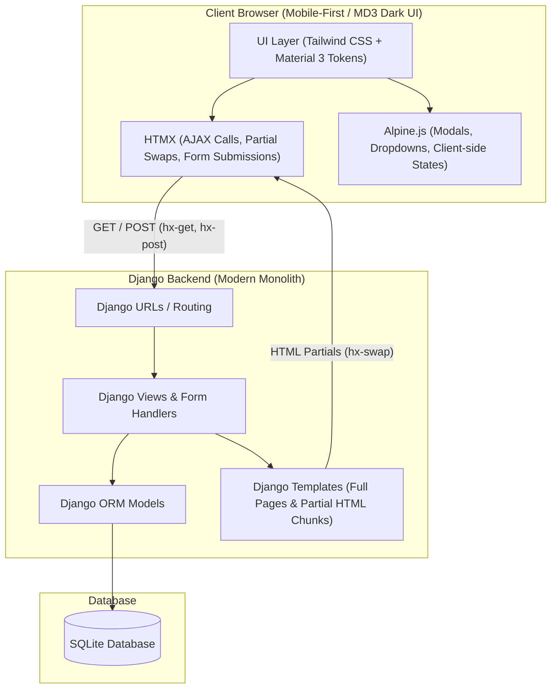
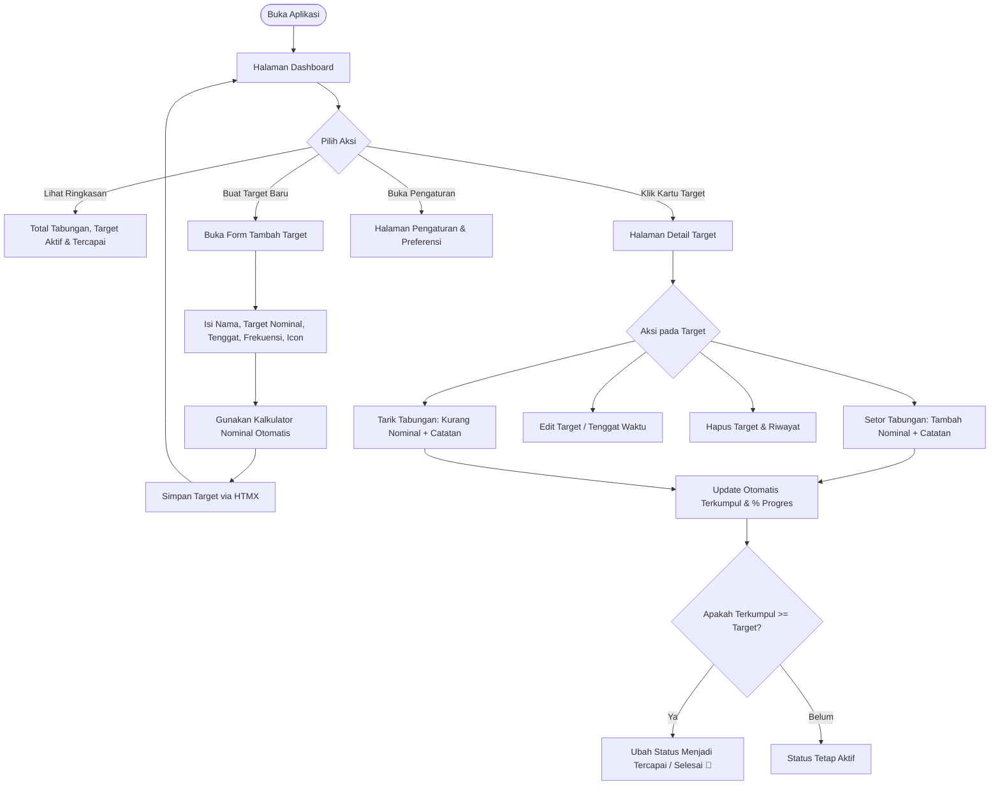
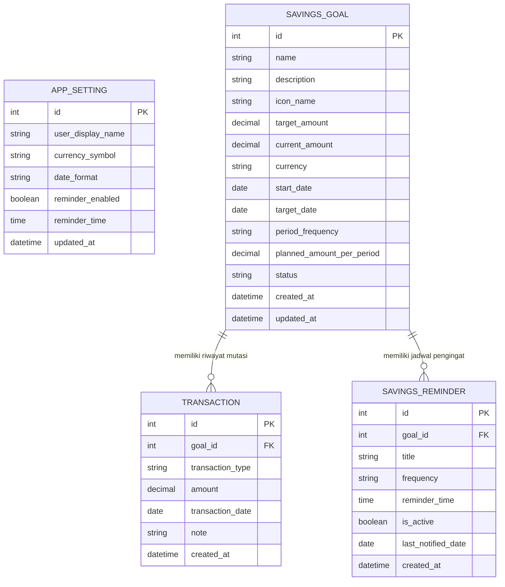

# Product Requirements Document (PRD) & Entity Relationship Diagram (ERD)
## Aplikasi: Celengan (Pencatat & Pemantau Target Tabungan)

---

## 1. Ringkasan Produk (Product Overview)
**Celengan** adalah aplikasi web personal (*single-user*) berbasis mobile-first yang dirancang untuk membantu pengguna merencanakan, mencatat, dan memantau progres pencapaian target tabungan secara visual, teratur, dan intuitif. 

Aplikasi ini mengadopsi arsitektur **Modern Monolith / HTML-over-the-Wire** menggunakan **DATH Stack** (Django, Alpine.js, Tailwind CSS, HTMX) dengan bahasa visual **Google Material Design 3 (MD3)** yang mengutamakan tema gelap (*dark mode*) sebagai tampilan utama.

Aplikasi ini **bukan** e-wallet, payment gateway, atau penyedia jasa keuangan, melainkan **buku catatan finansial digital berbasis target** (*goal-based savings tracker*).

---

## 2. Tujuan & Scope Proyek

### 2.1 Tujuan
- Memudahkan pengguna menetapkan target tabungan spesifik beserta tenggat waktu (*deadline*) dan frekuensi pengisian (harian, mingguan, bulanan).
- Menyediakan kalkulator rencana menabung otomatis untuk menghitung jumlah yang harus disisihkan per periode.
- Memberikan visualisasi kemajuan (*progress indicator*) yang memotivasi pengguna.
- Membantu pencatatan riwayat setoran (tambah) dan penarikan (kurang) dengan cepat tanpa beban *page-reload* berlebih.
- Dirancang khusus memenuhi standar tugas UTS yang fungsional, bersih, modular, dan realistis tanpa kompleksitas autentikasi multi-user.

### 2.2 Batasan Scope (In-Scope vs Out-of-Scope)
| In-Scope (Dikerjakan) | Out-of-Scope (Dihindari) |
| :--- | :--- |
| Single-user (tanpa login/register/role/session auth) | Multi-tenancy, registrasi, login, lupa password |
| Manajemen target tabungan (CRUD) | Koneksi rekening bank / API perbankan |
| Riwayat transaksi tabungan per target (Tambah/Kurang) | Payment gateway / transfer uang riil / e-wallet |
| Kalkulator target & rekomendasi nominal pengisian | Bunga bank, investasi, saham, kripto |
| Bottom navigation, dialog modal, MD3 dark theme | Panel super-admin kompleks |
| Pengingat/jadwal menabung lokal (browser notification / alert banner) | Pengiriman SMS / WhatsApp gateway berbayar |
| Pengaturan preferensi (mata uang default, toggle notifikasi) | Multi-currency live exchange rate API |

---

## 3. Arsitektur Teknologi (DATH Stack)

- **Django (Python)**: Core backend framework, routing, ORM, business logic, dan template rendering.
- **HTMX**: Mengakomodasi konsep *HTML-over-the-Wire* untuk interaksi dinamis (seperti menambah tabungan, filter riwayat, membuka modal form) tanpa reload halaman penuh.
- **Tailwind CSS**: Utility-first CSS untuk styling layout responsif dan komponen Material Design 3 (warna Surface, Primary, Secondary, Container, rounded corners 16–28px, elevation).
- **Alpine.js**: Mengelola interaktivitas mikro sisi klien (state modal, dropdown icon picker, kalkulator instan, drawer).
- **SQLite**: Database default Django yang ringan, portabel, dan cocok untuk arsitektur single-user.

---

## 4. Alur Pengguna (User Flow)

---

## 5. Kebutuhan Fungsional (Functional Requirements)

### 5.1 Modul Dashboard
- **FR-01**: Menampilkan ringkasan metrik utama dalam format kartu MD3:
  - Total uang yang terkumpul dari seluruh target.
  - Jumlah target tabungan yang masih aktif.
  - Jumlah target tabungan yang telah tercapai (*achieved*).
  - Rata-rata persentase pencapaian keseluruhan.
- **FR-02**: Menampilkan daftar kartu target tabungan aktif dengan *progress bar*, sisa nominal, dan tenggat waktu.
- **FR-03**: Menampilkan filter tab: **Semua**, **Aktif**, dan **Selesai/Tercapai**.
- **FR-04**: Tombol aksi cepat (*Floating Action Button / FAB*) untuk membuat target tabungan baru.

### 5.2 Modul Target Tabungan (Savings Goals)
- **FR-05**: Pengguna dapat menambahkan target tabungan baru dengan atribut:
  - Nama Target (contoh: "Beli Laptop Baru", "Dana Darurat").
  - Kategori / Icon (pilihan icon emoji atau Material Symbols).
  - Nominal Target (angka positif).
  - Mata Uang (default: IDR `Rp`).
  - Tanggal Target / Deadline.
  - Rencana Frekuensi Pengisian: Harian, Mingguan, atau Bulanan.
- **FR-06**: Pengguna dapat mengedit detail target tabungan.
- **FR-07**: Pengguna dapat menghapus target tabungan (beserta konfirmasi hapus modal dan penghapusan transaksi terkait secara *cascade*).
- **FR-08**: Sistem otomatis mengubah status menjadi `Tercapai` jika total terkumpul $\ge$ nominal target, dan menyediakan efek perayaan visual (badge selesai).

### 5.3 Modul Kalkulator & Rencana Tabungan
- **FR-09**: Saat membuat/mengedit target, aplikasi menyediakan kalkulator terintegrasi:
  - Menghitung sisa hari/minggu/bulan antara tanggal hari ini hingga tanggal target.
  - Menghitung rekomendasi nominal simpanan per periode:
    $$\text{Rekomendasi Setoran} = \frac{\text{Kekurangan Nominal}}{\text{Jumlah Periode Tersisa}}$$
- **FR-10**: Memberikan fleksibilitas bagi pengguna untuk menentukan nominal pengisian manual jika tidak menggunakan rekomendasi otomatis.

### 5.4 Modul Transaksi Tabungan (Transactions)
- **FR-11**: Pengguna dapat mencatat mutasi saldo pada target tertentu:
  - Tipe aksi: **Tambah (Deposit)** atau **Kurang (Withdrawal)**.
  - Nominal mutasi.
  - Tanggal transaksi (default: hari ini).
  - Catatan / Keterangan opsional (contoh: "Sisa uang saku", "Bonus proyek").
- **FR-12**: Sistem memperbarui jumlah saldo terkumpul dan persentase progress target secara *real-time* via HTMX partial swap.
- **FR-13**: Menampilkan daftar riwayat mutasi pada halaman detail target, diurutkan dari transaksi terbaru.
- **FR-14**: Pengguna dapat menghapus transaksi yang keliru catat, dan saldo target otomatis disesuaikan kembali.

### 5.5 Modul Notifikasi & Pengingat (Reminders)
- **FR-15**: Pengguna dapat mengaktifkan jadwal pengingat menabung sesuai frekuensi target (misal: "Ingatkan setiap pukul 20:00").
- **FR-16**: Menampilkan banner pengingat menabung hari ini pada bagian atas Dashboard jika ada target aktif yang belum diisi sesuai jadwal periodik.
- **FR-17**: Dukungan *Web Notification API* browser (opsional dapat diizinkan pengguna) untuk pengingat lokal tanpa butuh backend service berbayar.

### 5.6 Modul Pengaturan Aplikasi (Settings)
- **FR-18**: Pengaturan preferensi umum:
  - Nama panggilan pengguna (untuk sapaan ramah di Dashboard, misal: "Halo, Budi!").
  - Simbol mata uang default (default: `Rp`).
  - Format tanggal (DD/MM/YYYY).
- **FR-19**: Pengelolaan data:
  - Fitur *Reset Data* (hapus semua data tabungan dengan konfirmasi ketat).
  - Fitur *Load Dummy / Sample Data* (untuk kemudahan demonstrasi UTS penguji/dosen).

---

## 6. Desain Visual & UI/UX (Material Design 3 - Dark Theme)

Aplikasi mengutamakan tema gelap (*Dark Theme First*) sesuai pedoman Material Design 3:
- **Warna Palet (MD3 Dark Tokens)**:
  - `Surface / Background`: `#121316` (latar utama aplikasi)
  - `Surface Container`: `#1E1F24` (latar kartu & navigation bar)
  - `Surface Container High`: `#292A2F` (modal dialog, elevated cards)
  - `Primary`: `#A8C7FA` (Cyan/Sky Blue lembut khas MD3)
  - `On Primary`: `#062E6F`
  - `Primary Container`: `#0842A0`
  - `Secondary / Accent`: `#7FCFFF` / `#6DD58C` (hijau sukses untuk progress & status selesai)
  - `Outline / Border`: `#44474E`
  - `Error / Kurang`: `#F2B8B5` (soft red untuk penarikan/hapus)
- **Komponen Kunci**:
  - **Bottom Navigation Bar**: Navigasi tetap di bagian bawah layar (Dashboard, Target Tabungan, Pengingat, Pengaturan).
  - **Elevated / Filled Cards**: Sudut melengkung (*rounded-3xl* / 24px) dengan visual progress bar bertingkat.
  - **Floating Action Button (FAB)**: Akses instan di pojok kanan bawah untuk menambah tabungan baru.
  - **HTMX Modals / Bottom Sheets**: Form input yang muncul dari bawah pada layar smartphone tanpa navigasi pindah halaman.

---

## 7. Entity Relationship Diagram (ERD)

### 7.1 Diagram ERD (Mermaid)

---

### 7.2 Kamus Data & Spesifikasi Entitas

#### 1. Entitas: `SAVINGS_GOAL` (Target Tabungan)
Tabel utama penyimpan informasi target finansial yang ingin dicapai.

| Atribut | Tipe Data | Nullable | Default | Deskripsi |
| :--- | :--- | :---: | :--- | :--- |
| `id` | `INTEGER` | NO | AUTO_INCREMENT | Primary Key. |
| `name` | `VARCHAR(100)` | NO | - | Nama target (misal: "Beli Sepeda"). |
| `description` | `TEXT` | YES | NULL | Deskripsi atau motivasi target. |
| `icon_name` | `VARCHAR(50)` | NO | `'savings'` | Identifier icon MD3 / emoji. |
| `target_amount` | `DECIMAL(14,2)`| NO | - | Target nominal yang ingin dicapai. |
| `current_amount` | `DECIMAL(14,2)`| NO | `0.00` | Jumlah saldo yang telah terkumpul (dihitung otomatis). |
| `currency` | `VARCHAR(10)` | NO | `'IDR'` | Kode mata uang (IDR, USD, dll). |
| `start_date` | `DATE` | NO | `current_date` | Tanggal awal mulai menabung. |
| `target_date` | `DATE` | NO | - | Tenggat waktu / deadline target. |
| `period_frequency` | `VARCHAR(20)` | NO | `'DAILY'` | Rencana: `'DAILY'`, `'WEEKLY'`, `'MONTHLY'`. |
| `planned_amount_per_period` | `DECIMAL(14,2)` | NO | `0.00` | Nominal pengisian per periode hasil kalkulator. |
| `status` | `VARCHAR(20)` | NO | `'ACTIVE'` | Status target: `'ACTIVE'`, `'ACHIEVED'`, `'CANCELLED'`. |
| `created_at` | `DATETIME` | NO | `now()` | Timestamp pembuatan data. |
| `updated_at` | `DATETIME` | NO | `now()` | Timestamp pembaruan data terakhir. |

---

#### 2. Entitas: `TRANSACTION` (Mutasi Catatan Tabungan)
Tabel riwayat setiap mutasi penambahan atau pengurangan saldo pada target tabungan.

| Atribut | Tipe Data | Nullable | Default | Deskripsi |
| :--- | :--- | :---: | :--- | :--- |
| `id` | `INTEGER` | NO | AUTO_INCREMENT | Primary Key. |
| `goal_id` | `INTEGER` | NO | - | Foreign Key mengarah ke `SAVINGS_GOAL.id` (ON DELETE CASCADE). |
| `transaction_type` | `VARCHAR(10)` | NO | `'DEPOSIT'` | Tipe mutasi: `'DEPOSIT'` (+) atau `'WITHDRAW'` (-). |
| `amount` | `DECIMAL(14,2)`| NO | - | Nominal mutasi (harus > 0). |
| `transaction_date` | `DATE` | NO | `current_date` | Tanggal transaksi dilakukan. |
| `note` | `VARCHAR(255)`| YES | NULL | Catatan singkat sumber uang atau alasan penarikan. |
| `created_at` | `DATETIME` | NO | `now()` | Timestamp pencatatan transaksi. |

---

#### 3. Entitas: `SAVINGS_REMINDER` (Pengingat Jadwal Tabungan)
Tabel penyimpan jadwal pengingat untuk menabung pada target tertentu.

| Atribut | Tipe Data | Nullable | Default | Deskripsi |
| :--- | :--- | :---: | :--- | :--- |
| `id` | `INTEGER` | NO | AUTO_INCREMENT | Primary Key. |
| `goal_id` | `INTEGER` | NO | - | Foreign Key mengarah ke `SAVINGS_GOAL.id` (ON DELETE CASCADE). |
| `title` | `VARCHAR(100)` | NO | - | Pesan pengingat (contoh: "Waktunya isi celengan laptop!"). |
| `frequency` | `VARCHAR(20)` | NO | `'DAILY'` | Jadwal berulang: `'DAILY'`, `'WEEKLY'`, `'MONTHLY'`. |
| `reminder_time` | `TIME` | NO | `'20:00:00'` | Waktu jam pengingat dimunculkan. |
| `is_active` | `BOOLEAN` | NO | `TRUE` | Status aktif/non-aktif pengingat. |
| `last_notified_date`| `DATE` | YES | NULL | Tanggal terakhir notifikasi diberikan agar tidak duplikat. |
| `created_at` | `DATETIME` | NO | `now()` | Timestamp pembuatan pengingat. |

---

#### 4. Entitas: `APP_SETTING` (Konfigurasi & Profil Pengguna Tunggal)
Tabel singleton (hanya 1 baris) penyimpan preferensi aplikasi personal.

| Atribut | Tipe Data | Nullable | Default | Deskripsi |
| :--- | :--- | :---: | :--- | :--- |
| `id` | `INTEGER` | NO | `1` | Primary Key (dibatasi 1 row saja). |
| `user_display_name` | `VARCHAR(50)` | NO | `'Sahabat Menabung'` | Nama panggilan pengguna untuk sapaan di Dashboard. |
| `currency_symbol` | `VARCHAR(10)` | NO | `'Rp'` | Simbol tampilan mata uang. |
| `date_format` | `VARCHAR(20)` | NO | `'DD/MM/YYYY'` | Format tanggal aplikasi. |
| `reminder_enabled` | `BOOLEAN` | NO | `TRUE` | Toggle global banner/notifikasi pengingat. |
| `reminder_time` | `TIME` | NO | `'20:00:00'` | Waktu default harian pengingat menabung. |
| `updated_at` | `DATETIME` | NO | `now()` | Timestamp konfigurasi terakhir diperbarui. |

---

## 8. Hubungan / Relasi Antar Entitas (Relationships)
1. **`SAVINGS_GOAL` (1) ke `TRANSACTION` (N)**:
   - Relasi *One-to-Many*.
   - Satu target tabungan dapat memiliki banyak riwayat transaksi mutasi (setor atau tarik).
   - Menghapus satu target akan secara otomatis menghapus seluruh transaksi terkait (`ON DELETE CASCADE`).
   - Saldo `current_amount` pada `SAVINGS_GOAL` merupakan agregasi:
     $$\text{current\_amount} = \sum(\text{DEPOSIT}) - \sum(\text{WITHDRAW})$$

2. **`SAVINGS_GOAL` (1) ke `SAVINGS_REMINDER` (N)**:
   - Relasi *One-to-Many* (atau 1-to-1 tergantung kebutuhan konfigurasi target).
   - Satu target tabungan dapat memiliki jadwal pengingat khusus.
   - Dihapus otomatis jika target tabungan dihapus (`ON DELETE CASCADE`).

3. **`APP_SETTING`**:
   - Berdiri sendiri (*standalone singleton table*) sebagai referensi preferensi global sistem pengguna tunggal.

---

## 9. Penutup
Dokumen PRD & ERD ini menjadi acuan spesifikasi formal sebelum proses perancangan kode DATH Stack dimulai. Seluruh kebutuhan disusun dengan mempertimbangkan efisiensi, standar tugas akademik UTS, kemudahan pengujian, serta kepatuhan pada prinsip *clean architecture* dan Google Material Design 3.
