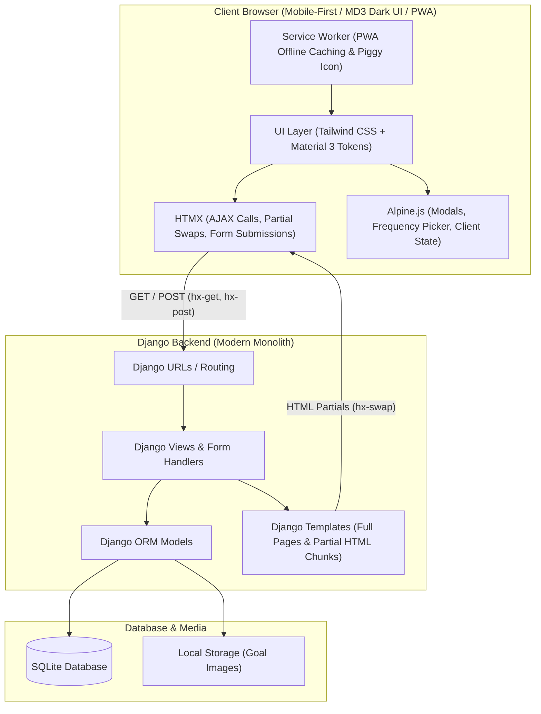
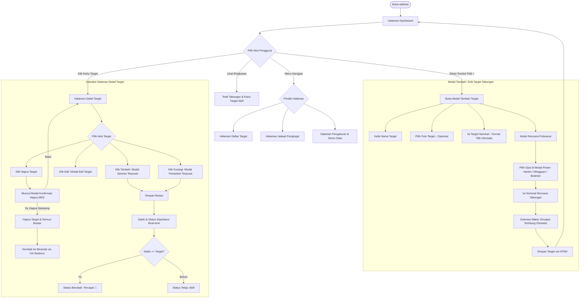
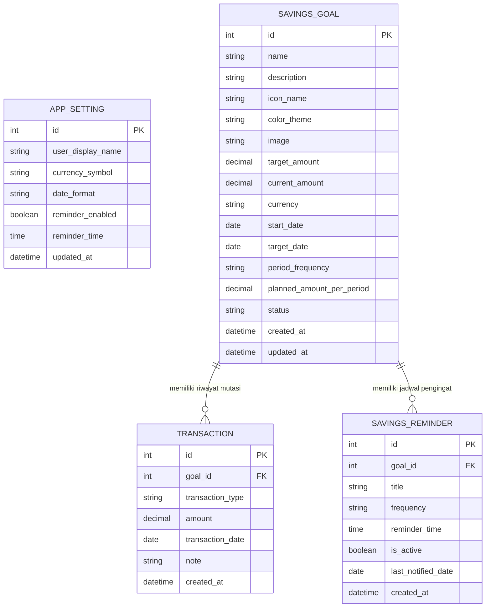

# Product Requirements Document (PRD) & Entity Relationship Diagram (ERD)
## Aplikasi: Celengan (Pencatat & Pemantau Target Tabungan)

---

## 1. Ringkasan Produk (Product Overview)
**Celengan** adalah aplikasi web personal (*single-user*) berbasis mobile-first yang dirancang untuk membantu pengguna merencanakan, mencatat, dan memantau progres pencapaian target tabungan secara visual, teratur, ringan, dan intuitif.

Aplikasi ini mengadopsi arsitektur **Modern Monolith / HTML-over-the-Wire** menggunakan **DATH Stack** (Django, Alpine.js, Tailwind CSS, HTMX) dengan bahasa visual **Google Material Design 3 (MD3)** yang mengutamakan tema gelap (*Dark Theme First*) dan mendukung instalasi aplikasi native lewat Progressive Web App (PWA).

Aplikasi ini **bukan** e-wallet, payment gateway, atau penyedia jasa keuangan, melainkan **buku catatan finansial digital berbasis target** (*goal-based savings tracker*).

---

## 2. Tujuan & Scope Proyek

### 2.1 Tujuan
- Memudahkan pengguna menetapkan target tabungan spesifik beserta unggahan foto impian, nominal target, dan frekuensi pengisian (harian, mingguan, bulanan).
- Menyediakan dialog modal interaktif yang nyaman: form terpusat dan elevated di layar mobile, modal konfirmasi hapus khusus (*danger modal*), dan modal picker untuk pemilihan frekuensi menabung.
- Menyediakan kalkulator rencana menabung otomatis untuk menghitung jumlah yang harus disisihkan per periode dan estimasi waktu tercapainya target.
- Membantu pencatatan riwayat setoran (tambah) dan penarikan (kurang) secara instan tanpa beban *page-reload* berlebih.
- Mengutamakan performa rendering yang sangat ringan pada perangkat mobile (*zero lag*) tanpa efek komputasi berat GPU.
- Dirancang khusus memenuhi standar tugas UTS yang fungsional, bersih, modular, dan realistis tanpa kompleksitas autentikasi multi-user.

### 2.2 Batasan Scope (In-Scope vs Out-of-Scope)
| In-Scope (Dikerjakan) | Out-of-Scope (Dihindari) |
| :--- | :--- |
| Single-user (tanpa login/register/role/session auth) | Multi-tenancy, registrasi, login, lupa password |
| Manajemen target tabungan (CRUD) + Upload Foto | Koneksi rekening bank / API perbankan |
| Riwayat transaksi tabungan per target (Tambah/Kurang) | Payment gateway / transfer uang riil / e-wallet |
| Modal terpusat & elevated untuk form target & mutasi | Form konvensional full-page reload |
| Modal Picker khusus untuk frekuensi (Harian, Mingguan, Bulanan) | Native `<select>` dropdown mentah |
| Modal konfirmasi hapus khusus bergaya MD3 | Dialog `window.confirm` / alert mentah browser |
| Animasi mikro ringan terakselerasi GPU (`will-change`, `transform`) | Animasi berat berbasis JS loop / canvas |
| Kalkulator target & rekomendasi nominal pengisian | Bunga bank, investasi, saham, kripto |
| PWA lengkap (Service Worker, Manifest, Piggy Bank Icon) | Notifikasi push cloud berbayar (FCM/OneSignal) |
| Pengingat/jadwal menabung lokal (browser notification / banner) | Pengiriman SMS / WhatsApp gateway berbayar |
| Pengaturan preferensi (nama, simbol mata uang, seed demo, reset) | Multi-currency live exchange rate API |

---

## 3. Arsitektur Teknologi (DATH Stack & PWA)

- **Django 5 (Python 3.14)**: Core backend framework, routing, ORM, business logic, dan template rendering.
- **HTMX 2**: Mengakomodasi konsep *HTML-over-the-Wire* untuk interaksi dinamis (seperti menambah tabungan, filter riwayat, membuka modal form, menghapus target) tanpa reload halaman penuh.
- **Tailwind CSS**: Utility-first CSS untuk styling layout responsif dan komponen Material Design 3 (warna Surface, Primary, Secondary, Container, rounded corners 24–32px).
- **Alpine.js 3**: Mengelola interaktivitas mikro sisi klien (state modal terpusat, modal picker frekuensi menabung, format titik ribuan otomatis, preview foto).
- **Service Worker & PWA**: Kemampuan caching offline (`celengan-v2`) dan ikon aplikasi celengan babi (*piggy bank*) mandiri di homescreen smartphone.
- **SQLite**: Database default Django yang ringan, portabel, dan ideal untuk arsitektur personal.

---

## 4. Alur Pengguna (User Flow)

---

## 5. Kebutuhan Fungsional (Functional Requirements)

### 5.1 Modul Dashboard
- **FR-01**: Menampilkan ringkasan metrik utama dalam format kartu MD3 yang bersih:
  - Total saldo tabungan yang telah terkumpul (dengan format rupiah rapi).
  - Total nominal yang ditargetkan dari seluruh impian.
  - Jumlah target tabungan aktif dan tercapai.
- **FR-02**: Menampilkan daftar kartu target tabungan aktif dengan visual cover foto, nominal saat ini, dan estimasi waktu selesai.
- **FR-03**: Tombol Floating Action Button (FAB) di tengah bilah navigasi bawah dengan animasi sentuh `touch-bounce` untuk membuka form modal target.

### 5.2 Modul Target Tabungan (Savings Goals)
- **FR-04**: Pengguna dapat menambahkan target tabungan baru dengan atribut:
  - Nama Target (contoh: "Beli Laptop Baru", "Liburan").
  - Foto/Gambar Target (opsional dengan preview instan).
  - Nominal Target (dengan format pemisah titik ribuan otomatis).
  - Rencana Frekuensi Pengisian: Harian, Mingguan, atau Bulanan (dipilih via **Modal Picker Khusus**).
  - Nominal Rencana Pengisian per periode.
- **FR-05**: Estimasi waktu tercapai (*time-to-goal*) dihitung otomatis secara real-time pada modal sesuai rencana pengisian.
- **FR-06**: Pengguna dapat mengedit data target tabungan.
- **FR-07**: Pengguna dapat menghapus target tabungan melalui **Modal Konfirmasi Khusus (Custom MD3 Delete Modal)** dengan tombol konfirmasi bahaya merah (`bg-error`), menghapus seluruh catatan transaksi terkait secara *cascade*.
- **FR-08**: Sistem otomatis mengubah status menjadi `Tercapai` jika total saldo $\ge$ target nominal.

### 5.3 Modul Transaksi Tabungan (Transactions)
- **FR-09**: Pengguna dapat mencatat mutasi saldo pada target tertentu melalui modal yang terpusat dan elevated:
  - Tipe aksi: **Tambah (Deposit)** atau **Kurang (Withdrawal)**.
  - Nominal mutasi (dengan chip nominal cepat & pemisah ribuan otomatis).
  - Tanggal mutasi dan catatan opsional.
- **FR-10**: Riwayat transaksi tercatat rapi dan transaksi yang salah dapat dihapus dengan penyesuaian saldo otomatis.

### 5.4 Modul Notifikasi & Pengingat (Reminders)
- **FR-11**: Pengguna dapat mengaktifkan jadwal pengingat menabung sesuai jam dan frekuensi yang ditentukan.
- **FR-12**: Toggle status aktif/mati pengingat secara instan via HTMX.
- **FR-13**: Banner jadwal pengingat harian otomatis muncul jika ada target tabungan aktif yang perlu diisi.

### 5.5 Modul Pengaturan & Utilitas Demonstrasi (Settings)
- **FR-14**: Pengaturan profil sapaan pengguna dan simbol mata uang default (`Rp`).
- **FR-15**: Tombol **Isi Sampel Data Tabungan (Demo)** untuk langsung mempopulasikan data uji siap pakai.
- **FR-16**: Tombol **Reset Semua Data** untuk mengosongkan database kembali ke titik nol.

---

## 6. Desain Visual & UI/UX (Material Design 3 - Dark Theme First)

- **Warna Palet (MD3 Dark Tokens)**:
  - `Surface / Background`: `#121316` (latar belakang solid hemat daya)
  - `Surface Container`: `#1C1D22` (kartu target & panel navigasi)
  - `Surface Container High`: `#27282F` (modal form terpusat)
  - `Primary`: `#A8C7FA` (Cyan/Sky Blue MD3)
  - `Secondary / Accent`: `#7FCFFF`
  - `Tertiary`: `#6DD58C` (Hijau sukses untuk status tercapai)
  - `Outline / Border`: `#44474E`
  - `Error / Danger`: `#F2B8B5` / `#B3261E` (merah untuk hapus & penarikan)
- **Peningkatan Ergonomi & UI Mobile**:
  - **Centered & Elevated Modals**: Modal form target dan mutasi tabungan berada di posisi tengah layar dengan offset `-translate-y-4` yang nyaman dijangkau jari dan tidak terhimpit keyboard virtual.
  - **Frequency Selection Modal**: Pemilihan frekuensi menabung menggunakan modal kartu picker dengan ikon dan keterangan jelas, menggantikan dropdown `<select>` mentah bawaan browser.
  - **Custom Delete Confirmation Modal**: Dialog konfirmasi hapus khusus dengan ikon peringatan bahaya, menggantikan alert browser mentah.
  - **Micro-Animations Ringan**: Animasi *pop-in* modal (`anim-modal`), *slide-up* kartu (`anim-slide-up`), dan sensasi tombol kenyal (`touch-bounce`) yang digerakkan sepenuhnya oleh GPU (`transform` & `opacity`).
  - **Optimasi Performa Ponsel**: Menonaktifkan efek berat `backdrop-filter: blur` pada layar kecil (`@media (max-width: 768px)`) untuk menjamin navigasi 60 FPS tanpa patah-patah.

---

## 7. Entity Relationship Diagram (ERD)

### 7.1 Diagram ERD (Mermaid)

---

### 7.2 Kamus Data & Spesifikasi Entitas

#### 1. Entitas: `SAVINGS_GOAL` (Target Tabungan)
Tabel utama penyimpan informasi target impian finansial.

| Atribut | Tipe Data | Nullable | Default | Deskripsi |
| :--- | :--- | :---: | :--- | :--- |
| `id` | `INTEGER` | NO | AUTO_INCREMENT | Primary Key. |
| `name` | `VARCHAR(100)` | NO | - | Nama target (misal: "Beli Laptop", "Dana Darurat"). |
| `description` | `TEXT` | YES | NULL | Catatan motivasi target. |
| `icon_name` | `VARCHAR(50)` | NO | `'savings'` | Identifier icon MD3. |
| `color_theme` | `VARCHAR(20)` | NO | `'blue'` | Pilihan tema aksen target. |
| `image` | `VARCHAR(100)` | YES | NULL | Lokasi file foto target di `media/goals/`. |
| `target_amount` | `DECIMAL(14,2)`| NO | - | Nominal target yang ingin dicapai. |
| `current_amount` | `DECIMAL(14,2)`| NO | `0.00` | Saldo terkumpul (hasil kalkulasi transaksi). |
| `currency` | `VARCHAR(10)` | NO | `'IDR'` | Kode mata uang. |
| `start_date` | `DATE` | NO | `current_date` | Tanggal mulai menabung. |
| `target_date` | `DATE` | YES | NULL | Tanggal tenggat waktu (opsional). |
| `period_frequency` | `VARCHAR(20)` | NO | `'DAILY'` | Pilihan frekuensi: `'DAILY'`, `'WEEKLY'`, `'MONTHLY'`. |
| `planned_amount_per_period` | `DECIMAL(14,2)` | NO | `0.00` | Rencana nominal simpanan per periode. |
| `status` | `VARCHAR(20)` | NO | `'ACTIVE'` | Status: `'ACTIVE'`, `'ACHIEVED'`, `'CANCELLED'`. |
| `created_at` | `DATETIME` | NO | `now()` | Waktu pembuatan data. |
| `updated_at` | `DATETIME` | NO | `now()` | Waktu pembaruan data terakhir. |

---

#### 2. Entitas: `TRANSACTION` (Mutasi Catatan Tabungan)
Tabel riwayat setiap mutasi penambahan atau penarikan saldo.

| Atribut | Tipe Data | Nullable | Default | Deskripsi |
| :--- | :--- | :---: | :--- | :--- |
| `id` | `INTEGER` | NO | AUTO_INCREMENT | Primary Key. |
| `goal_id` | `INTEGER` | NO | - | Foreign Key ke `SAVINGS_GOAL.id` (ON DELETE CASCADE). |
| `transaction_type` | `VARCHAR(10)` | NO | `'DEPOSIT'` | Tipe mutasi: `'DEPOSIT'` (+) atau `'WITHDRAW'` (-). |
| `amount` | `DECIMAL(14,2)`| NO | - | Nominal mutasi (harus > 0). |
| `transaction_date` | `DATE` | NO | `current_date` | Tanggal mutasi dilakukan. |
| `note` | `VARCHAR(255)`| YES | NULL | Catatan singkat sumber uang / keterangan. |
| `created_at` | `DATETIME` | NO | `now()` | Timestamp pencatatan transaksi. |

---

#### 3. Entitas: `SAVINGS_REMINDER` (Pengingat Jadwal Tabungan)
Tabel pengingat periodik untuk menyisihkan uang ke celengan.

| Atribut | Tipe Data | Nullable | Default | Deskripsi |
| :--- | :--- | :---: | :--- | :--- |
| `id` | `INTEGER` | NO | AUTO_INCREMENT | Primary Key. |
| `goal_id` | `INTEGER` | NO | - | Foreign Key ke `SAVINGS_GOAL.id` (ON DELETE CASCADE). |
| `title` | `VARCHAR(100)` | NO | - | Pesan pengingat menabung. |
| `frequency` | `VARCHAR(20)` | NO | `'DAILY'` | Jadwal berulang: `'DAILY'`, `'WEEKLY'`, `'MONTHLY'`. |
| `reminder_time` | `TIME` | NO | `'20:00:00'` | Waktu jam pengingat dimunculkan. |
| `is_active` | `BOOLEAN` | NO | `TRUE` | Status aktif/nonaktif jadwal. |
| `last_notified_date`| `DATE` | YES | NULL | Tanggal terakhir notifikasi diberikan. |
| `created_at` | `DATETIME` | NO | `now()` | Timestamp pembuatan pengingat. |

---

#### 4. Entitas: `APP_SETTING` (Konfigurasi Singleton)
Tabel konfigurasi preferensi pengguna tunggal.

| Atribut | Tipe Data | Nullable | Default | Deskripsi |
| :--- | :--- | :---: | :--- | :--- |
| `id` | `INTEGER` | NO | `1` | Primary Key singleton (1 baris saja). |
| `user_display_name` | `VARCHAR(50)` | NO | `'Sahabat Menabung'` | Nama panggilan pengguna untuk salam di Dashboard. |
| `currency_symbol` | `VARCHAR(10)` | NO | `'Rp'` | Simbol mata uang default. |
| `date_format` | `VARCHAR(20)` | NO | `'DD/MM/YYYY'` | Format tanggal aplikasi. |
| `reminder_enabled` | `BOOLEAN` | NO | `TRUE` | Toggle global pengingat. |
| `reminder_time` | `TIME` | NO | `'20:00:00'` | Jam default pengingat menabung. |
| `updated_at` | `DATETIME` | NO | `now()` | Timestamp pembaruan konfigurasi. |

---

## 8. Penutup
Spesifikasi PRD, User Flow, dan ERD ini telah diselaraskan dengan arsitektur termutakhir aplikasi Celengan, mencakup penyempurnaan UI modal terpusat, pemilihan frekuensi kustom, modal konfirmasi hapus aman, serta optimasi performa mobile tanpa lag.
